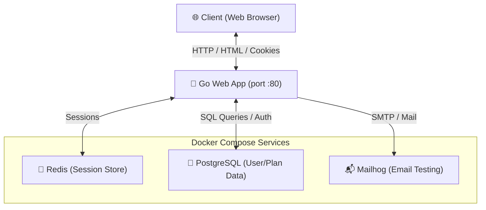

# 🚀 Sub-Service: The Ultimate Subscription Engine 🐹

[](https://golang.org)
[](https://www.postgresql.org)
[](https://redis.io)
[](https://github.com/mailhog/MailHog)

Welcome to **Sub-Service**, a robust, concurrently minded, high-performance web subscription manager written in Go! It features Postgres for relational persistence, Redis for session state tracking, and Mailhog for localized email flow testing.

---

## 🗺️ System Architecture

Here is how the magic happens under the hood:



---

## ✨ Features

- 👤 **Full User Authentication** — Secure login/logout handlers with salted BCrypt password hashing.
- 💳 **Plan Management** — Subscribe users to distinct plans with display formatting.
- 📦 **Redis Session Store** — Secure, persistent, cookie-backed sessions using `alexedwards/scs`.
- 🏗️ **Clean Partial Architecture** — Standardized page layouts using Go `html/template` inheritance.
- 🪵 **Shutdown Listeners** — Graceful cleanup handlers using WaitGroups for active routines.

---

## 🚀 Getting Started

Follow these steps to launch the service in your local sandbox:

### 1. Spin up the Infrastructure 🐳
Start PostgreSQL, Redis, and Mailhog in background containers:
```bash
docker-compose up -d
```

### 2. Launch the Web Server 🐹
Use the `Makefile` command to build and execute the binary locally:
```bash
make start
```

> [!TIP]
> Need to check if it's running? Run `ps aux | grep myapp` or check the logs.

### 3. Stop the Application 🛑
To terminate the background Go server gracefully:
```bash
make stop
```

---

## 🛠️ The Developer Toolkit (`Makefile`)

We've bundled a handy set of commands to keep your developer workflow super smooth:

| Command | Action | Description |
| :--- | :--- | :--- |
| `make build` | 🏗️ Compilation | Builds the Go binary (`myapp`) with optimized flags. |
| `make run` / `make start` | 🚀 Execution | Compiles the binary and spins up the server in the background. |
| `make stop` | 🛑 Termination | Gracefully terminates any running server process. |
| `make restart` | 🔄 Reload | Stops the server, rebuilds, and boots it back up. |
| `make clean` | 🧹 Housekeeping | Cleans up go binaries and run-caches. |
| `make test` | 🧪 Validation | Runs the Go test suite (`go test -v ./...`). |

---

## 📂 Project Structure At A Glance

- `main.go` — Entrypoint, sets up Redis, DB connection pools, session manager, and serves HTTP.
- `routes.go` — URL multiplexer routing endpoints (`/login`, `/register`, etc.) with recovery middleware.
- `handlers.go` — Web handlers rendering templates for pages and processing user submissions.
- `render.go` — Template parsing helper loading HTML partials (`base.layout.gohtml`, `navbar.partial.gohtml`).
- `config.go` — Core configuration struct containing DB pool, Logger references, and sync WaitGroup.
- `data/` — Data access models for `User` and `Plan`.
- `templates/` — HTML template layouts, layouts, and components.

---

> [!IMPORTANT]
> Make sure the environment variables `DSN` (Data Source Name for Postgres) and `REDIS` (Redis server address) are correctly configured. By default, the `Makefile` populates these for localhost, but you'll need to update them if hosting remotely!

Have fun building! 🎉